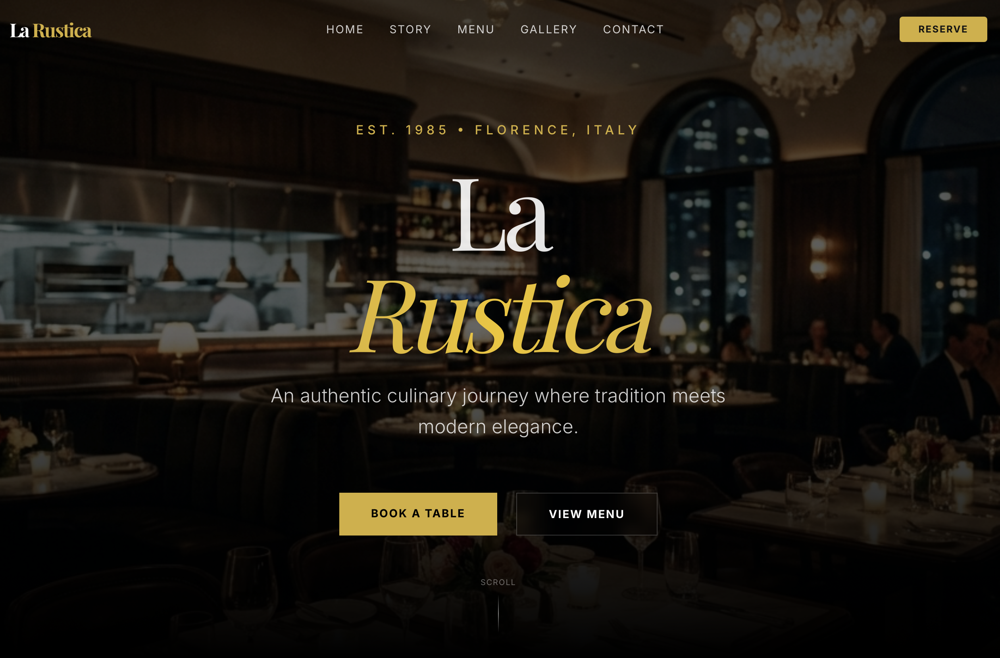

# La Rustica



A modern, high-performance website for **La Rustica**, a fictional authentic Italian restaurant. Built with **Next.js 16**, **Tailwind CSS**, and **Framer Motion**, this project demonstrates a premium digital presence with smooth animations, interactive menus, and a storytelling-driven user experience.

## ✨ Features

-   **Cinematic Hero Section**: Full-screen parallax effects with premium typography.
-   **Interactive Menu**: Tabbed menu grid (`Antipasti`, `Primi`, `Secondi`, `Dolci`) with animations.
-   **Reservations System**: Functional form with date/time pickers and success feedback.
-   **Storytelling Page**: Dedicated `/story` page showcasing the restaurant's heritage.
-   **Visual Gallery**: Curated atmosphere section using CSS grid layout.
-   **Responsive Design**: Fully optimized for mobile, tablet, and desktop.

## 🛠️ Tech Stack

-   **Framework**: [Next.js 16 (App Router)](https://nextjs.org/)
-   **Styling**: [Tailwind CSS v4](https://tailwindcss.com/)
-   **Animation**: [Framer Motion](https://www.framer.com/motion/)
-   **UI Primitives**: [Radix UI](https://www.radix-ui.com/)
-   **Icons**: [Lucide React](https://lucide.dev/)
-   **Font**: Custom Serif & Sans-serif implementation.

## 🚀 Getting Started

1.  **Clone the repository**
    ```bash
    git clone https://github.com/7sg56/la-rustica.git
    cd la-rustica
    ```

2.  **Install dependencies**
    ```bash
    npm install
    ```

3.  **Run the development server**
    ```bash
    npm run dev
    ```
    Open [http://localhost:3000](http://localhost:3000) to view it in your browser.

## 📄 License

This project is licensed under the MIT License - see the [LICENSE](./LICENSE) file for details.
